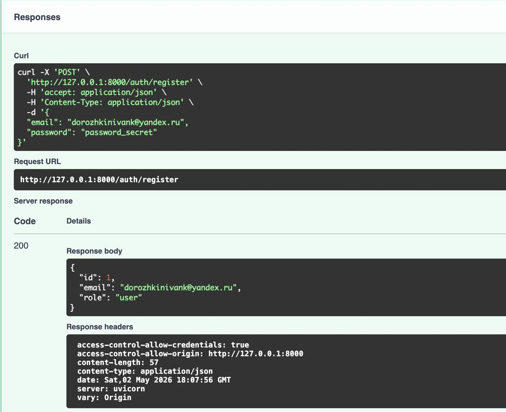
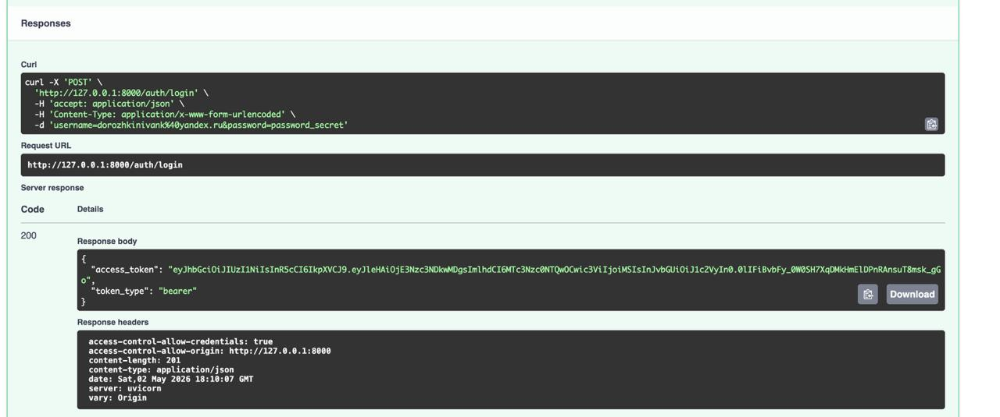
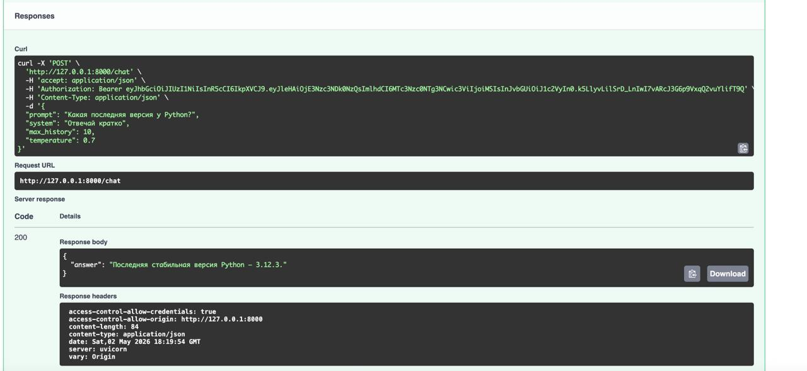
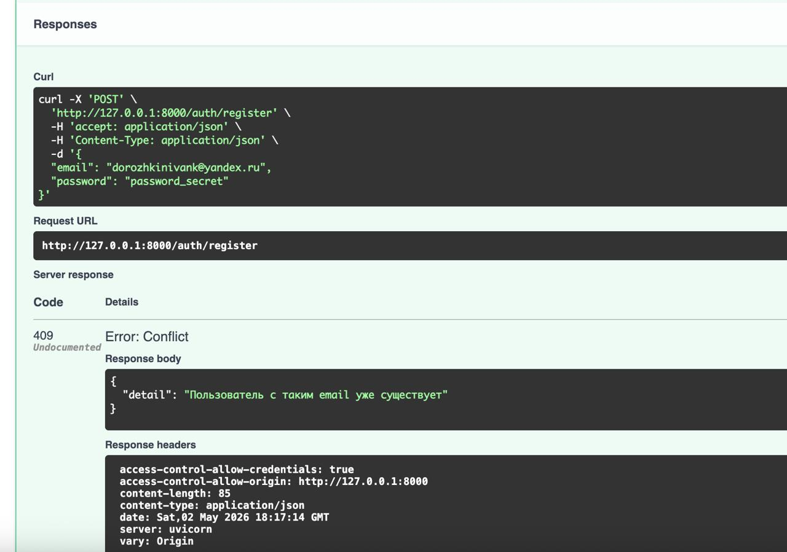
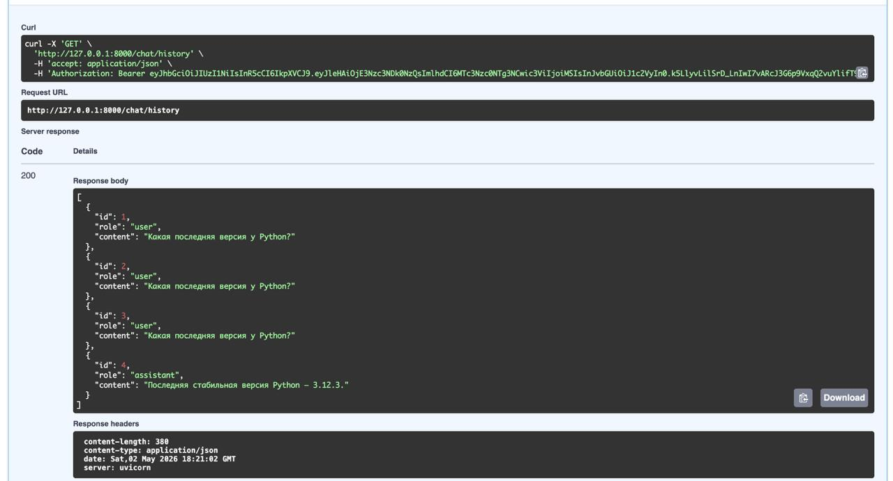
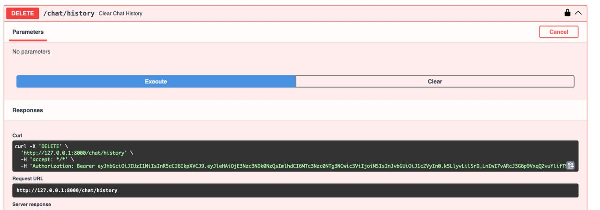
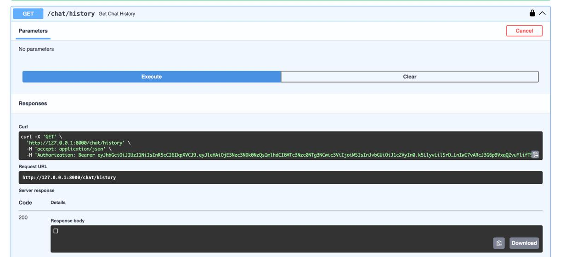

# Построение защищённого API для работы с LLM через OpenRouter

## Описание проекта
Данный проект представляет собой серверное приложение на базе FastAPI, предоставляющее защищённый API для взаимодействия с большой языковой моделью (LLM) через внешний сервис OpenRouter. 

Проект реализован с соблюдением принципов «Чистой архитектуры» (Layered Architecture) и жестким разделением ответственности между слоями:
- API-слой (`app/api`): обработка HTTP-запросов и Dependency Injection.
- Бизнес-логика (`app/usecases`): управление процессами (регистрация, чат, генерация контекста).
- Слой доступа к данным (`app/repositories`): выполнение запросов к БД (SQLAlchemy).
- Слой внешних сервисов (`app/services`): HTTP-клиент для работы с API OpenRouter.
- Слой БД (`app/db`): декларативные ORM-модели и подключение к SQLite.

Аутентификация и авторизация реализованы на базе JWT (JSON Web Tokens). Управление зависимостями и виртуальным окружением осуществляется с помощью современного и быстрого инструмента uv.

---

## Установка и запуск проекта (через uv)

Инструкция предполагает запуск приложения с чистого листа.

### 1. Установка менеджера пакетов uv
Если `uv` ещё не установлен в системе, выполните команду:
```bash
pip install uv
```

### 2. Создание виртуального окружения
Перейдите в корневую папку проекта и создайте виртуальное окружение с привязкой к Python 3.11+:
```bash
uv venv --python 3.11
```

Активируйте виртуальное окружение: `source .venv/bin/activate`

### 3. Установка зависимостей
Установка пакетов происходит на основе файла `pyproject.toml`. Выполните компиляцию и установку:
```bash
uv pip compile pyproject.toml -o requirements.txt
uv pip install -r requirements.txt
```

### 4. Настройка переменных окружения
В корне проекта создайте файл `.env`, важно заполнить ключ OpenRouter:

```env
APP_NAME=llm-p
ENV=local

JWT_SECRET=change_me_super_secret
JWT_ALG=HS256
ACCESS_TOKEN_EXPIRE_MINUTES=60

SQLITE_PATH=./app.db

OPENROUTER_API_KEY=key
OPENROUTER_BASE_URL=https://openrouter.ai/api/v1
OPENROUTER_MODEL=openrouter/auto
OPENROUTER_SITE_URL=https://example.com
OPENROUTER_APP_NAME=llm-fastapi-openrouter
```

### 5. Запуск сервера
После настройки запустите проект командой:
```bash
uv run uvicorn app.main:app --reload --host 0.0.0.0 --port 8000
```
Интерфейс Swagger UI будет доступен по адресу: [http://127.0.0.1:8000/docs](http://127.0.0.1:8000/docs)

---

## Демонстрация работы сервиса

Ниже представлены скриншоты успешного тестирования всех основных сценариев работы приложения через Swagger UI.
*Примечание: Согласно требованиям задания, при регистрации использован email в формате `student_surname@email.com`.*

### 1. Регистрация пользователя (POST `/auth/register`)
Успешное создание нового пользователя в базе данных.


### 2. Логин и получение JWT (POST `/auth/login`)
Успешная авторизация по email и паролю с генерацией Bearer токена.


### 3. Запрос к LLM (POST `/chat`)
Отправка системного промпта и запроса пользователя, успешное получение ответа от языковой модели OpenRouter.


### 4. Проверка валидации (POST `/auth/register`)
Сервис блокирует создание пользователя с уже использованным email.


### 5. Получение истории чата (GET `/chat/history`)
Извлечение истории диалога (вопросов пользователя и ответов ассистента) из базы данных SQLite, привязанной к текущему пользователю.


### 6. Очистка истории чата (DELETE `/chat/history`)
Успешное удаление всех сообщений пользователя из базы данных (возврат HTTP 204 No Content).


### 7. Демонстрация очистки истории (GET `/chat/history`)
Извлечение пустой истории диалога, она была очищена на предыдущем шаге.


---
Проект успешно проходит проверку линтером ruff
